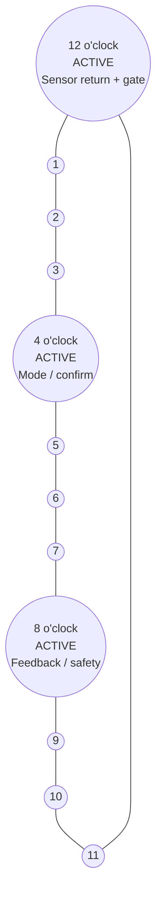
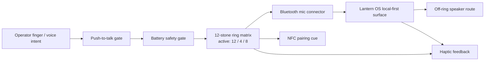
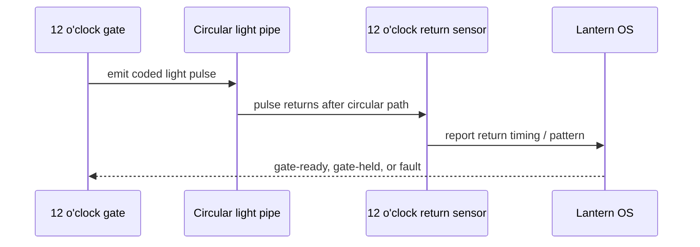

# Lantern Ring Audio Gate MK1 - Concept Report

**Date:** 2026-05-28  
**Status:** candidate concept sheet / public-safe system diagram  
**Surface:** Lantern OS / Lantern Ring / audio gate / RAG-indexable artifact  
**Branch:** `codex/lantern-ring-audio-gate-mk1`

## Decision

Converge the current Lantern Ring work into a public-safe MK1 concept artifact before any merge, production, shipment, or hardware build claim.

This report captures the system shape for review. It is not a fabrication file, electrical certification, medical/safety device claim, patent claim, order, shipment, or production approval.

## Core concept

**Lantern Ring Audio Gate MK1** is a wearable control-ring concept for local-first Lantern OS interaction.

It combines:

- a 12-stone symbolic matrix;
- 3 active stones at 12, 4, and 8 o'clock;
- push-to-talk audio gating;
- Bluetooth microphone connector route;
- haptic response;
- NFC pairing cue;
- battery safety requirements;
- off-ring speaker route;
- optical self-loop validation pulse.

## Ring layout

The ring is modeled as a 12-position matrix. Three stones are active in MK1:

| Position | Status | Intended role |
|---:|---|---|
| 12 o'clock | active | sensor return / primary gate / status marker |
| 4 o'clock | active | input / mode / confirmation marker |
| 8 o'clock | active | feedback / route / safety marker |
| Other 9 stones | passive / reserved | visual matrix, future expansion, non-active placeholders |



## Functional block diagram



## Optical self-loop

The optical self-loop is a validation concept: a coded light pulse travels around the circular light pipe and returns to a sensor at 12 o'clock.

Purpose:

- confirm the ring path is intact;
- provide a non-audio local status signal;
- support a gate-ready / gate-held distinction;
- avoid claiming success from audio or Bluetooth status alone.



## Orion Watch MK1 engineering boundary

The uploaded Orion Watch MK1 intake is now treated as the safety standard for MK1 wearable work.

MK1 should remain an existing-watch-platform prototype:

- existing round smartwatch donor platform;
- Orion / Lantern OS watchface;
- phone-side or local companion layer;
- push-to-talk as the default audio gate;
- haptic confirmation;
- wellness-only sensor language;
- custom strap, box, and presentation only;
- no custom PCB for MK1;
- no custom RF design for MK1;
- no custom battery for MK1;
- no medical claims;
- no payment NFC claim;
- no water-resistance claim beyond supplier-proven certification.

The ring concept can remain a future control-surface / docking / accessory lane, but it must not be confused with a build-ready custom electronics plan.

## Supplier evidence gate

Before any sample payment or batch-of-2 lead action, request supplier evidence:

1. exact model number;
2. SoC / chipset family if available;
3. display type and resolution;
4. battery capacity and battery safety documentation;
5. charger specs;
6. FCC / CE / RoHS / UN38.3 documents if available;
7. Bluetooth declaration or qualification information if available;
8. documented water-resistance support if any IP / ATM claim is made;
9. watchface customization method;
10. app / firmware customization limits;
11. sample lead time and shipping method;
12. unit quote at 2 / 10 / 50 / 100 / 500.

## Public-safe boundaries

Allowed in this artifact:

- concept-level ring layout;
- functional routing;
- symbolic stone positions;
- public-safe optical self-loop explanation;
- Orion Watch MK1 donor-platform requirements;
- validation gates;
- MCP/handoff status language.

Held outside this artifact:

- exact dimensions;
- electronic schematics;
- battery chemistry selection;
- enclosure tolerances;
- firmware implementation;
- manufacturing drawings;
- supplier quotes;
- certification or compliance claims;
- production, shipment, or sale claims.

## Battery and audio safety gates

Battery safety is treated as a gate, not a solved feature. MK1 cannot be called build-ready until the following are reviewed by a qualified hardware path:

- safe charge/discharge design;
- thermal handling;
- enclosure heat risk;
- short-circuit protection;
- user-contact safety;
- transport/storage handling;
- compliance path for any real device.

For Orion Watch MK1, the safest path is factory-certified battery/charger only. Do not design a custom Li-ion pack for MK1.

Audio safety is also gated:

- push-to-talk must default to off;
- off-ring speaker route avoids forcing output into a wearable ring body;
- no hidden hot-mic claim;
- no always-on recording claim;
- local-first routing must be inspected before calling any connector live.

## MCP / handoff status

Current status for this artifact:

```json
{
  "surface": "lantern-ring-audio-gate-mk1",
  "workLoadedToMcp": "held",
  "reason": "remote repo artifact can be created, but local MCP/orchestrator queue state requires operator-machine evidence",
  "safeFallback": "branch and PR are the handoff surface until a local MCP probe records queue/tool evidence",
  "nextAction": "local agent probes MCP, verifies exposed tools, then links the PR or emits a held receipt"
}
```

## Validation checklist

- [x] Ring concept captured as `Lantern Ring Audio Gate MK1`.
- [x] 12-stone matrix included.
- [x] 3 active stones at 12 / 4 / 8 included.
- [x] Bluetooth mic connector route included.
- [x] Push-to-talk gate included.
- [x] Battery safety handled as a validation gate, not as solved hardware.
- [x] Haptic feedback included.
- [x] NFC pairing cue included.
- [x] Off-ring speaker route included.
- [x] Optical self-loop with coded pulse return to 12 o'clock sensor included.
- [x] Orion Watch MK1 donor-platform boundary included.
- [x] No custom PCB / RF / battery claim for MK1.
- [x] Wellness-only sensor language boundary included.
- [x] Supplier evidence checklist included.
- [x] Public-safe boundary included.
- [x] No merge performed by this report.
- [x] No production, shipment, certification, or fabrication claim.

## Recommended next action

Open this branch as a PR. Use the PR as the handoff surface. Do not merge until:

1. remote file validation passes;
2. the fleet responds with status receipts;
3. local MCP/orchestrator evidence is either attached or explicitly held;
4. any hardware/safety claims remain concept-only or are moved to a qualified review lane.
