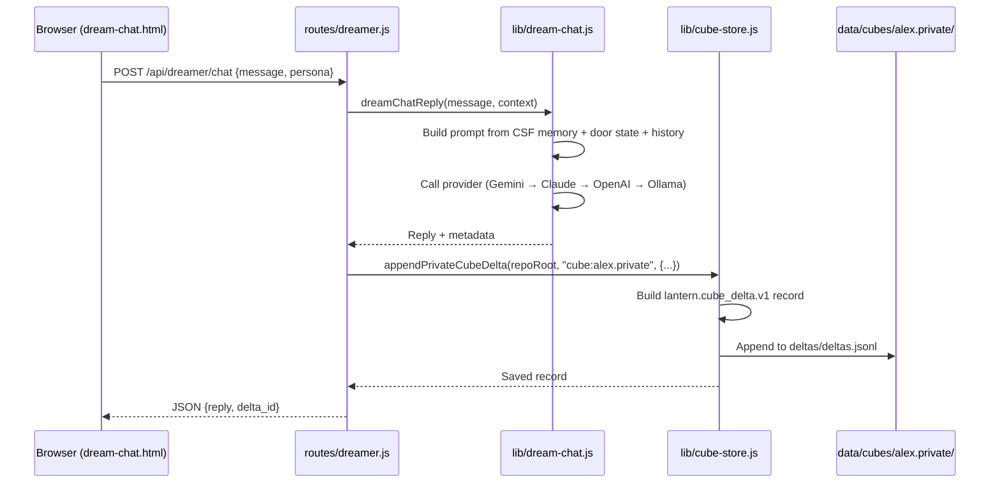
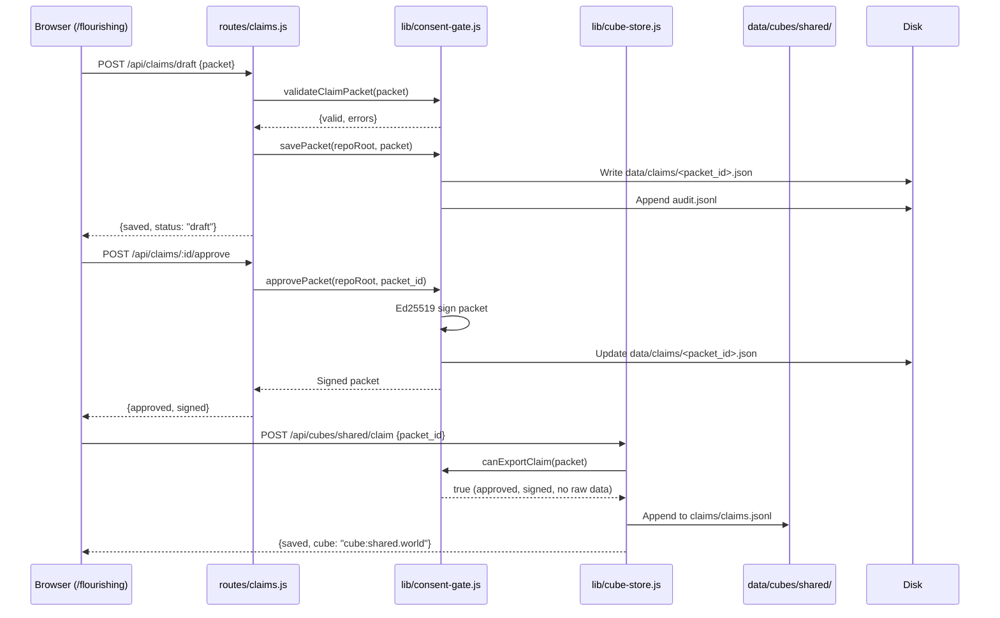

# Lantern OS — Architecture Codemaps

**Visual maps of module dependencies, routes, and data flows.**  
**For the feature status roadmap, see `CODEMAP.md`.**

---

## 1. Module Dependency Graph

```mermaid
graph TD
    subgraph "Entry Point"
        S[server.js]
    end

    subgraph "Routes (URL → Handler)"
        R1[routes/status.js]
        R2[routes/dream.js]
        R3[routes/dreamer.js]
        R4[routes/flourishing.js]
        R5[routes/claims.js]
        R6[routes/cubes.js]
        R7[routes/operator.js]
        R8[routes/files.js]
        R9[routes/surfaces.js]
        R10[routes/keystone.js]
        R11[routes/image.js]
        R12[routes/rag.js]
    end

    subgraph "Core Libraries"
        L1[lib/dream-chat.js]
        L2[lib/stream-chat.js]
        L3[lib/cube-store.js]
        L4[lib/consent-gate.js]
        L5[lib/csf-memory.js]
        L6[lib/file-queue.js]
        L7[lib/http-utils.js]
        L8[lib/conversation-store.js]
        L9[lib/dreamer-store.js]
        L10[lib/provider-cache.js]
        L11[lib/status.js]
    end

    subgraph "Data Stores"
        D1[data/cubes/alex.private/]
        D2[data/cubes/shared/]
        D3[data/claims/]
        D4[data/csf-memory/]
        D5[data/nodes/]
        D6[data/dreamer/]
    end

    S --> R1 & R2 & R3 & R4 & R5 & R6 & R7 & R8 & R9 & R10 & R11 & R12
    R2 --> L1 & L2
    R3 --> L1 & L9
    R5 --> L4
    R6 --> L3 & L4
    R7 --> L8
    R4 --> L11
    R1 --> L11
    R12 --> L5

    L3 --> L6
    L4 --> L6
    L5 --> L6
    L1 --> L7
    L2 --> L7
    L3 --> L7

    L3 --> D1 & D2 & D5
    L4 --> D3
    L9 --> D6
    L5 --> D4
```



---

## 2. Route-to-Handler Map

| Method | Path | Route File | Handler / Purpose |
|---|---|---|---|
| GET | `/api/health` | `routes/status.js` | Health probe |
| GET | `/api/status` | `routes/status.js` | Full system state |
| POST | `/api/dream/chat` | `routes/dream.js` | Non-streaming chat (multi-provider) |
| GET | `/api/dream/chat/stream` | `routes/dream.js` | SSE streaming chat |
| GET | `/api/dreamer` | `routes/dreamer.js` | List dream entries |
| POST | `/api/dreamer/chat` | `routes/dreamer.js` | Dream + chat combined |
| GET | `/api/agents` | `routes/dreamer.js` | Persona roster |
| GET | `/api/agents/slots` | `routes/dreamer.js` | Agent slot queue |
| GET | `/api/flourishing` | `routes/flourishing.js` | HFF dashboard data |
| GET | `/api/claims` | `routes/claims.js` | List claim packets |
| POST | `/api/claims/draft` | `routes/claims.js` | Create/update draft |
| POST | `/api/claims/:id/approve` | `routes/claims.js` | Approve + sign |
| POST | `/api/claims/:id/reject` | `routes/claims.js` | Reject packet |
| GET | `/api/claims/export-ready` | `routes/claims.js` | Exportable packets |
| GET | `/api/cubes/local` | `routes/cubes.js` | Alex private cube summary |
| GET | `/api/cubes/shared` | `routes/cubes.js` | Shared world cube summary |
| POST | `/api/cubes/alex/delta` | `routes/cubes.js` | Write private cube event |
| POST | `/api/cubes/shared/claim` | `routes/cubes.js` | Submit claim to shared cube |
| GET | `/api/cubes/allies` | `routes/cubes.js` | List allies |
| POST | `/api/allies/invite` | `routes/cubes.js` | Invite ally |
| GET | `/repo/*` | `routes/files.js` | File browser |
| GET | `/view` | `routes/files.js` | Markdown viewer |
| GET | `/hub` | `routes/surfaces.js` | Redirect to `/flourishing` |
| GET | `/flourishing` | `routes/surfaces.js` | Serves `flourishing.html` |
| GET | `/` | `routes/surfaces.js` | Serves `index.html` |

**Route ordering in `server.js` matters.** Specific routes (e.g., `/api/claims/export-ready`) must be registered before general patterns (e.g., `/api/claims/:id`) and before the static file catch-all in `routes/surfaces.js`.

---

## 3. Data Flow: Dream Chat → Private Cube



---

## 4. Data Flow: Claim Packet → Shared Cube



---

## 5. Directory Tree (Annotated)

```
lantern-os/
├── apps/lantern-garage/          # Web server + API + PWA
│   ├── server.js                  # Entry: route dispatch, port 4177
│   ├── routes/
│   │   ├── status.js              # /api/health, /api/status
│   │   ├── dream.js               # /api/dream/* (chat, streaming)
│   │   ├── dreamer.js             # /api/dreamer/* (CRUD, chat)
│   │   ├── flourishing.js         # /api/flourishing (HFF dashboard)
│   │   ├── claims.js              # /api/claims/* (claim lifecycle)
│   │   ├── cubes.js               # /api/cubes/*, /api/allies/*
│   │   ├── operator.js            # /api/operator-notes
│   │   ├── files.js               # /repo/*, /view
│   │   └── surfaces.js            # /hub, /flourishing, static files
│   ├── lib/
│   │   ├── dream-chat.js          # Non-streaming chat + persona selection
│   │   ├── stream-chat.js         # SSE streaming (provider chain)
│   │   ├── cube-store.js          # Private/shared cube delta writer
│   │   ├── consent-gate.js        # Claim validation, Ed25519 signing
│   │   ├── csf-memory.js          # CSF long-term memory reader
│   │   ├── file-queue.js          # Queued JSONL/text writes
│   │   ├── http-utils.js          # sendJson, sendFile, collectBody
│   │   ├── conversation-store.js  # JSONL conversation persistence
│   │   ├── dreamer-store.js       # Dream entry read/write
│   │   ├── provider-cache.js      # PCSF 60s provider state cache
│   │   └── status.js              # System state aggregation
│   └── public/                    # Static assets (HTML, CSS, JS)
│       ├── dream-chat.html         # Personal symbolic interface
│       ├── flourishing.html        # World/cube dashboard
│       └── js/                    # Frontend scripts
│
├── data/
│   ├── cubes/
│   │   ├── alex.private/           # Alex Private Cube
│   │   │   ├── manifest.json       # Cube metadata
│   │   │   └── deltas/           # lantern.cube_delta.v1 events
│   │   └── shared/                 # Shared World Cube
│   │       ├── manifest.json       # Cube metadata
│   │       └── claims/           # Consented claim packets
│   ├── claims/                     # Claim packet storage (gitignored)
│   ├── nodes/
│   │   ├── local-node.json        # This node's identity
│   │   └── allies.jsonl           # Ally registry
│   ├── csf-memory/                 # CSF structured records
│   ├── dreamer/                    # Dream journal entries
│   └── status/
│       └── status-cube.json        # 4D convergence state
│
├── src/
│   ├── csf/                        # Python CSF memory engine
│   ├── convergence_io/             # StatusCube, Bayesian beliefs
│   └── mcp_server/                 # MCP server (optional, port 8771)
│
├── tests/
│   ├── test_claim_packets.js       # 11 claim API tests
│   ├── test_cube_network.js        # 6 cube network tests
│   └── test_dream_chat_multiturns.js # Multi-turn chat tests
│
├── docs/
│   ├── CODEMAP.md                  # Feature status roadmap
│   ├── CODEMAP-ARCHITECTURE.md     # This file
│   └── AGENTS.md                   # AI agent guidelines
│
├── data/pcsf/                      # Provider configs
│   ├── model.pcsf.json
│   ├── agent.pcsf.json
│   ├── settings.pcsf.json
│   └── narrator.pcsf.json
│
└── manifests/
    ├── CONVERGENCE-LOOP-AGENT-FLEET.md
    └── dream-journal-v1-agent-slots.json
```

---

## 6. Critical Files for Token Saving

**When working on a feature, read these first (not the whole codebase):**

| Feature | Read First | Why |
|---|---|---|
| Chat / personas | `data/pcsf/narrator.pcsf.json` | Persona routing rules |
| Provider chain | `data/pcsf/model.pcsf.json` | Default model per provider |
| Any route | `routes/<feature>.js` | Single-file responsibility |
| Cube events | `lib/cube-store.js` | One file for all cube I/O |
| Claim packets | `lib/consent-gate.js` | Validation + signing logic |
| Streaming | `lib/stream-chat.js` | SSE + provider fallback chain |
| Static files | `routes/surfaces.js` | Catch-all ordering |

---

*This document is a visual companion to `CODEMAP.md`. Update both when adding major features.*
