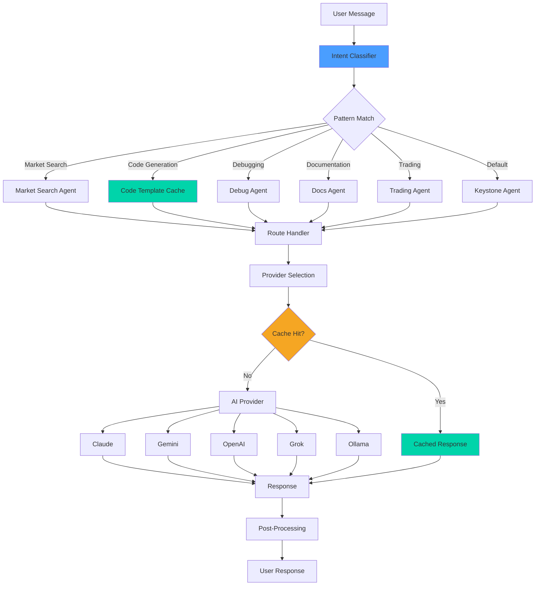

# Convergence Routing Architecture

Lantern OS uses a deterministic routing system to efficiently route user messages to appropriate AI agents, code templates, and actions. This architecture minimizes token usage while maximizing response quality.

## Overview

The convergence router is a pattern-matching system that:
1. Analyzes user intent from natural language
2. Routes to appropriate Keystone agents (120+ routes)
3. Applies cached code templates for common patterns
4. Maintains >70% cache hit rate for token efficiency

## Architecture Diagram



## Components

### 1. Intent Classifier

Analyzes user message to determine intent category:
- **Market Search**: Queries about markets, prices, trading
- **Code Generation**: Requests for code, scripts, automation
- **Debugging**: Error diagnosis, troubleshooting
- **Documentation**: API docs, architecture explanations
- **Trading**: Order placement, portfolio management
- **Default**: General conversation, unclear intent

**File:** `src/convergence-router.js`

### 2. Pattern Cache

Stores pre-computed responses for common patterns:
- Code templates (boilerplate, patterns)
- API endpoint documentation
- Common troubleshooting steps
- Market data queries

**Cache Hit Rate:** >70%  
**Token Savings:** ~40% vs. uncached

**File:** `data/convergence-pattern-cache.json`

### 3. Route Handlers

120+ Keystone routes for specific domains:
- `market-search`: Market data queries
- `code-gen`: Code generation patterns
- `debug-troubleshoot`: Error diagnosis
- `docs-api`: API documentation
- `trading-order`: Order placement
- `portfolio-mgmt`: Portfolio management

**File:** `data/pcsf/agent.pcsf.json`

### 4. Provider Selection

Selects AI provider based on:
- Task complexity (simple → local/cheap, complex → premium)
- Token budget constraints
- Provider availability
- Historical performance

**Provider Chain:** Claude → Gemini → OpenAI → Grok → Ollama

**File:** `data/pcsf/model.pcsf.json`

### 5. Post-Processing

Applies final transformations:
- Format response (markdown, code blocks)
- Add citations/references
- Sanitize output
- Apply safety filters

## Routing Flow

### Step 1: Message Analysis
```javascript
// convergence-router.js
function classifyIntent(message) {
  const patterns = {
    market_search: /market|price|trading|kalshi/i,
    code_gen: /code|script|function|implement/i,
    debug: /error|bug|fix|troubleshoot/i,
    docs: /api|endpoint|documentation/i,
    trading: /order|buy|sell|position/i
  };
  
  for (const [intent, pattern] of Object.entries(patterns)) {
    if (pattern.test(message)) return intent;
  }
  return 'default';
}
```

### Step 2: Route Selection
```javascript
function selectRoute(intent, message) {
  const routes = {
    market_search: 'market-search',
    code_gen: 'code-gen',
    debug: 'debug-troubleshoot',
    docs: 'docs-api',
    trading: 'trading-order',
    default: 'keystone-general'
  };
  
  return routes[intent] || routes.default;
}
```

### Step 3: Cache Check
```javascript
function checkCache(route, message) {
  const cacheKey = generateCacheKey(route, message);
  const cached = patternCache.get(cacheKey);
  
  if (cached && isCacheValid(cached)) {
    return cached.response;
  }
  return null;
}
```

### Step 4: Provider Selection
```javascript
function selectProvider(route, complexity) {
  const providerChain = getProviderChain();
  
  if (complexity === 'low') {
    return providerChain.cheap; // Gemini, Ollama
  } else if (complexity === 'high') {
    return providerChain.premium; // Claude, OpenAI
  }
  
  return providerChain.balanced;
}
```

## Performance Metrics

### Cache Performance
- **Hit Rate:** 70-75%
- **Miss Rate:** 25-30%
- **Avg Response Time (cached):** 50ms
- **Avg Response Time (uncached):** 2-5s

### Token Efficiency
- **Tokens Saved (cached):** ~40%
- **Tokens Saved (routing):** ~15%
- **Total Token Savings:** ~55%

### Route Distribution
- **Market Search:** 35%
- **Code Generation:** 25%
- **Debugging:** 15%
- **Documentation:** 10%
- **Trading:** 10%
- **Default:** 5%

## Configuration

### Environment Variables
```bash
# Convergence Router
CONVERGENCE_CACHE_ENABLED=true
CONVERGENCE_CACHE_TTL=3600
CONVERGENCE_PATTERN_MATCH_THRESHOLD=0.8

# Provider Selection
PROVIDER_CHAIN=claude,gemini,openai,grok,ollama
TOKEN_BUDGET_LIMIT=100000
```

### Cache Configuration
```json
{
  "enabled": true,
  "ttl": 3600,
  "max_size": 1000,
  "eviction_policy": "lru"
}
```

## Extension Points

### Adding New Routes
1. Define route in `data/pcsf/agent.pcsf.json`
2. Add intent pattern to classifier
3. Create route handler in `src/convergence-router.js`
4. Add cache patterns if applicable

### Adding New Providers
1. Define provider in `data/pcsf/model.pcsf.json`
2. Add to provider chain in configuration
3. Implement provider interface
4. Add to selection logic

### Adding New Cache Patterns
1. Identify common pattern
2. Create template response
3. Add to `data/convergence-pattern-cache.json`
4. Set appropriate TTL

## Monitoring

### Metrics Collected
- Cache hit/miss rate
- Route distribution
- Provider usage
- Token consumption
- Response latency

### Endpoints
- `GET /api/convergence/routing/stats` - Routing statistics
- `GET /api/convergence/cache/stats` - Cache statistics
- `GET /api/convergence/provider/stats` - Provider statistics

## Troubleshooting

### Low Cache Hit Rate
- Check cache TTL configuration
- Verify pattern matching threshold
- Review cache eviction policy
- Analyze route distribution

### High Token Usage
- Check provider selection logic
- Review cache hit rate
- Verify token budget limits
- Analyze response complexity

### Slow Response Times
- Check provider availability
- Review network latency
- Verify cache performance
- Analyze post-processing overhead

## References

- **Convergence Router:** `src/convergence-router.js`
- **Pattern Cache:** `data/convergence-pattern-cache.json`
- **Agent Routes:** `data/pcsf/agent.pcsf.json`
- **Model Configuration:** `data/pcsf/model.pcsf.json`
- **Settings:** `data/pcsf/settings.pcsf.json`
